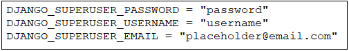
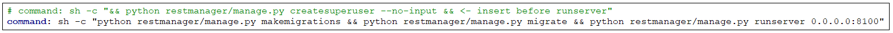
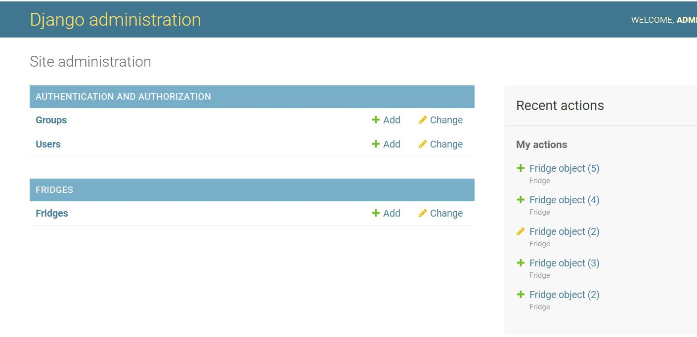

## Django admin user creation &  admin panel usage

### Shortcuts:

[Admin panel usage](#admin-ui)
 

**1 Add your preferred admin panel login credentials to .env file** (`remember to add .env to .gitignore`) 
**location <app_root>/.env**

 

**2 Add command `python <app_root>/manage.py createsuperuser --no-input` to docker-compose.yml before the runserver command (Remember to separate the commands with &&)**

**3 Git add changes, commit & push**

**4 Go into your deployed projects admin panel which is typically found at /admin/ and test that the login credentials work**

**5 Remove or comment the createsuperuser command from docker-compose.yml**
 

****

**6 Admin panel usage & functionality:**
 

    Once you have registered your app or apps with the django admin panel it should appear here under authentication & authorization in its own section.
    You can add new or change existing objects to the database from here.
 

**Adding objects to the database:**

    Defaults set in restmanager/fridges/defaultvars.py help with adding fridges quickly to the database. 
    Upon saving the object the page should notify you of the objects creation.

**Changing existing objects values from the database:**

    Change the objects values as you please here and upon pressing save you should get a notification of the changes being saved.

**Deleting objects from the database:**

    Tick the boxes next to fridges u wish to delete and then select "Delete selected fridges" from the dropdown menu.
    Django should warn you about the deletion and ask you to confirm the action. 

[Return to start of document](#start)