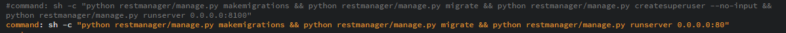
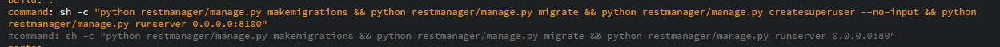

**Running fridge manager for the first time**

Copy the project from [https://github.com/softalaproject/fridge\_manager](https://github.com/softalaproject/fridge_manager) to your computer using Git BASH or by downloading the zip file

create .env file to the projects root

example **: C:\Users\userName\Desktop\fridge_manager-master\.env**

This file contains the following information:

    MYSQL_ROOT_PASSWORD=mariadbroot
    MYSQL_DATABASE=mariadbdjango
    MYSQL_USER=mariadbuser
    MYSQL_PASSWORD=mariadbpassword

create a second .env file to the projects restmanager folder

example: **C:\Users\userName\Desktop\fridge_manager-master\restmanager\.env**

This file contains the following information:

    IP2="INSERT HOST MACHINES IP HERE"
    DJANGO_TOKEN="PASTE YOUR DJANGO TOKEN HERE"
    SLACK_TOKEN="PASTE YOUR SLACK TOKEN HERE"
    DJANGO_SUPERUSER_PASSWORD="adminpasswordeficode"
    DJANGO_SUPERUSER_USERNAME="Admineficode"
    DJANGO_SUPERUSER_EMAIL="placeholder@email.com"
    DB_NAME="mariadbdjango"
    DB_USER="mariadbuser"
    DB_PASSWORD="mariadbpassword"
    DB_HOST="mariadb-db"
    DB_PORT="3306"

When running the app for the first time, we want to create a superuser account so we have to do make some changes in the **docker-compose.yml** file

The file is located at the projects root folder **C:\Users\userName\Desktop\fridge_manager-master\docker-compose.yml**

Navigate the file until you come across these two lines.

Remove the hashtag from the beginning of the first line and move it in front of the second line.

After doing so, save the file but keep the file open because we need to change it back after you launch the app for the first time.

We are now ready to build the docker image

With your terminal navigate to the projects root folder and run the command:

**docker-compose build**

Then run the command:

**docker-compose up -d**

This will create the superuser account with the details you have included in the second .env file. Before migrating and running the server we need to go back to the **docker-compose.yml** file and change the hashtags place to its original place.

changing this:

into this:

Now run the command **docker-compose up -d**

this will now migrate the database and start the server. You can now go to your localhost [http://127.0.0.1/](http://127.0.0.1/) and start using the app.